# Polyglot Codebase Knowledge Graph

> Generated offline by **readmenator**. 3 files, 16 symbols, 17 imports. Supports C, C++, Python, Go, Rust, JS/TS, Java, C#, Shell, PHP, Dart, GDScript, Nim, ASM, Ruby, Swift, Kotlin, Scala, Lua, Elixir.
> No LLMs. No tokens. Pure static analysis. See more [here](https://github.com/grisuno/ReadMenator)

**Start here:** Statistics Dashboard for scope, God Nodes for blast radius, Architecture Reference for per-file API. Agents: prefer `readmenator-agent/INDEX.md` + `SYMBOLS.md`.

**Wiki:** prefer `readmenator-wiki/index.md` for progressive disclosure: one synthesis page per community, `connections.json` with EXTRACTED vs INFERRED confidence, `queries.md` log, `REPORT.md` audit.

**Confidence:** EXTRACTED = parsed from source, INFERRED = heuristic bridge, AMBIGUOUS = reported, never hidden. See `readmenator-wiki/REPORT.md`.

**Total Files Parsed:** 3 | **Total Symbols Extracted:** 16 | **Total Imports:** 17
 | **Resolved Imports:** 1

<!-- ranking_model: v1.0 | weights: {ppr:0.45,auth:0.2,test:0.15,doc:0.1,fresh:0.1} | alpha:0.85 | commit:b3ca3bb | date:2026-07-18 -->


## Table of Contents

1. [Statistics Dashboard](#statistics-dashboard)
2. [Architectural Layers](#architectural-layers)
3. [Ranked Context](#ranked-context)
4. [God Nodes](#god-nodes)
5. [Community Analysis](#community-analysis)
6. [Suggested Questions](#suggested-questions)
7. [Hotspot Analysis](#hotspot-analysis)
8. [Change Impact Analysis](#change-impact-analysis)
9. [Suggested Linting Rules](#suggested-linting-rules)
10. [Orphans](#orphans)
11. [Query Recipes](#query-recipes)
12. [Structural Knowledge Map](#structural-knowledge-map)
13. [UML Class Diagram](#uml-class-diagram)
14. [Code Property Graph](#code-property-graph)
15. [Architecture Reference](#architecture-reference)
    - [JS (3 files)](#js-3-files)

---

## Statistics Dashboard

| Metric | Value |
|--------|-------|
| Total Files | 3 |
| Total Symbols | 16 |
| Total Imports | 17 |
| Call Edges | 208 |
| Inheritance Edges | 1 |
| Languages | 1 |
| Avg Symbols/File | 5.3 |
| Avg Imports/File | 5.7 |
| Resolved Imports | 1 |

### Top Files by Import Count (Fan-Out)

| File | Imports | Symbols | Language |
|------|---------|---------|----------|
| `app.js` | 8 | 6 | js |
| `Condorito.js` | 5 | 9 | js |
| `app_example.js` | 4 | 1 | js |

---

## Architectural Layers

Auto-detected from path patterns, naming conventions, and imported frameworks.

| Layer | Files |
|-------|-------|
| presentation | 3 |

### presentation

- `Condorito.js` (js, 9 symbols)
- `app.js` (js, 6 symbols)
- `app_example.js` (js, 1 symbols)

---

## Ranked Context

Files ranked by composite score for the current query context. The ranking combines Personalized PageRank (query relevance), global authority, test coverage, documentation coverage, and code freshness. Model: v1.0.

| Rank | File | Composite | PPR | Authority | Test | Doc |
|------|------|-----------|-----|-----------|------|-----|
| 1 | `Condorito.js` | 0.4330 | 0.6491 | 0.6491 | 0.00 | 0.11 |
| 2 | `app_example.js` | 0.3281 | 0.3509 | 0.3509 | 0.00 | 1.00 |
| 3 | `app.js` | 0.0000 | 0.0000 | 0.0000 | 0.00 | 0.00 |

---

## God Nodes

Most architecturally central files ranked by combined import/export degree and symbol richness.

| File | Score | Connections | PageRank |
|------|-------|-------------|----------|
| `Condorito.js` | 2.9 | | 0.6491 |
| `app_example.js` | 2.1 | | 0.3509 |
| `app.js` | 0.6 | | 0.0000 |

---

## Community Analysis

Files grouped by import-based community detection. Cohesion measures how tightly connected each community is internally.

### root (Cohesion: 1.00)

**2 files** in this community:

- `Condorito.js` (js, 9 symbols)
- `app_example.js` (js, 1 symbols)

---

## Suggested Questions

Auto-generated exploration prompts based on graph structure:

- What does Condorito.js depend on, and what depends on it? (1 connections)
- What does app_example.js depend on, and what depends on it? (1 connections)
- What does app.js depend on, and what depends on it? (0 connections)
- What is Condorito in Condorito.js and how is it used?
- What is ViewRenderer in app.js and how is it used?

---

## Hotspot Analysis

Files ranked by combined complexity (symbol count) and centrality (connection count). High-scoring files are architecturally critical and may need refactoring attention.

| File | Complexity | Centrality | Combined | Symbols | Connections |
|------|-----------|------------|----------|---------|-------------|
| `Condorito.js` | 1.000 | 0.978 | 0.987 | 9 | 90 |
| `app_example.js` | 0.111 | 0.489 | 0.338 | 1 | 45 |
| `app.js` | 0.667 | 1.000 | 0.867 | 6 | 92 |

---

## Change Impact Analysis

Files sorted by how many other files would be affected if they changed. High-impact files should be changed with caution.

| File | Direct Dependents | Transitive Dependents | Total Impact |
|------|------------------|----------------------|--------------|
| `Condorito.js` | 1 | 0 | 1 |
| `app.js` | 0 | 0 | 0 |
| `app_example.js` | 0 | 0 | 0 |

---

## Suggested Linting Rules

Automatically suggested linting and security rules based on patterns detected in the codebase. These can be exported as Semgrep rules using the `--export-rules` flag.

| Rule ID | Severity | Description | Language | Matches |
|---------|----------|-------------|----------|---------|
| `RM001` | info | Large number of functions in js: 4 total | js | 4 |

---

## Orphans

Files with no documentation or low connectivity. These are candidates for documentation investment or cleanup.

- `app.js` (6 symbols, no doc)

---

## Query Recipes

Example queries you can run against this knowledge base using the ranking engine:

```
# Find files most relevant to a concept
readmenator query "Where is the import resolver implemented?"

# Rank files by relevance to a topic
readmenator query "How does documentation generation work?"

# Explain why a file ranks highly
readmenator query "explain readmenator/_documentation.py"

# Trace dependency paths with ranked context
readmenator query "path from CLI to exporter"
```

The ranking model uses the following signals:

- **Personalized PageRank** (45% weight): query-specific relevance via seed propagation
- **Global Authority** (20% weight): structural importance via standard PageRank
- **Test Coverage** (15% weight): fraction of symbols referenced in test files
- **Doc Coverage** (10% weight): presence of docstrings and file-level docs
- **Freshness** (10% weight): recent modification activity

Results include score decomposition and justification paths for each ranked item.

---

## Structural Knowledge Map


---

## UML Class Diagram

Auto-generated Mermaid class diagram from parsed class-level symbols. Shows classes, structs, interfaces, traits, and their methods with inheritance and dependency relationships.

```mermaid
classDiagram
  class Condorito_js_Condorito {
    <<class>>
  }
  class Condorito_js_Channels {
    <<class>>
  }
  class Condorito_js_Presence {
    <<class>>
  }
  class Condorito_js_PubSub {
    <<class>>
  }
  class Condorito_js_ElixirLikeSyntax {
    <<class>>
  }
  class Condorito_js_Resource {
    <<class>>
  }
  class Condorito_js_AutomaticCodeReloading {
    <<class>>
  }
  class Condorito_js_LiveView {
    <<class>>
  }
  class Condorito_js_LiveViewManager {
    <<class>>
  }
  class app_js_ViewRenderer {
    <<class>>
    +listarAudios
    +startRecording
    +stopRecording
    +playRecording
  }
  class app_js_LiveView {
    <<class>>
    +listarAudios
    +startRecording
    +stopRecording
    +playRecording
  }
  class app_example_js_CustomLiveView {
    <<class>>
  }
```



---

## Code Property Graph

Machine-readable Code Property Graph (CPG) in JSON-LD format. This block allows AI agents to parse the full structural graph without additional file reads. Compatible with GraphRAG pipelines.

```json
{"@context": "https://schema.org", "analysis": {"communities": [{"cohesion": 1.0, "id": 0, "label": "root", "size": 2}], "god_nodes": [{"node_id": "Condorito.js", "score": 2.9}, {"node_id": "app_example.js", "score": 2.1}, {"node_id": "app.js", "score": 0.6}], "surprising_connections": []}, "edges": [{"confidence": "EXTRACTED", "relation": "imports", "source": "Condorito.js", "target": "fs"}, {"confidence": "EXTRACTED", "relation": "imports", "source": "Condorito.js", "target": "express"}, {"confidence": "EXTRACTED", "relation": "imports", "source": "Condorito.js", "target": "https"}, {"confidence": "EXTRACTED", "relation": "imports", "source": "Condorito.js", "target": "cors"}, {"confidence": "EXTRACTED", "relation": "imports", "source": "Condorito.js", "target": "ws"}, {"confidence": "EXTRACTED", "relation": "calls", "source": "Condorito.js", "target": "require"}, {"confidence": "EXTRACTED", "relation": "calls", "source": "Condorito.js", "target": "require"}, {"confidence": "EXTRACTED", "relation": "calls", "source": "Condorito.js", "target": "require"}, {"confidence": "EXTRACTED", "relation": "calls", "source": "Condorito.js", "target": "require"}, {"confidence": "EXTRACTED", "relation": "calls", "source": "Condorito.js", "target": "require"}, {"confidence": "EXTRACTED", "relation": "calls", "source": "Condorito.js", "target": "constructor"}, {"confidence": "EXTRACTED", "relation": "calls", "source": "Condorito.js", "target": "initExpress"}, {"confidence": "EXTRACTED", "relation": "calls", "source": "Condorito.js", "target": "initExpress"}, {"confidence": "EXTRACTED", "relation": "calls", "source": "Condorito.js", "target": "express"}, {"confidence": "EXTRACTED", "relation": "calls", "source": "Condorito.js", "target": "constructor"}, {"confidence": "EXTRACTED", "relation": "calls", "source": "Condorito.js", "target": "join"}, {"confidence": "EXTRACTED", "relation": "calls", "source": "Condorito.js", "target": "push"}, {"confidence": "EXTRACTED", "relation": "calls", "source": "Condorito.js", "target": "leave"}, {"confidence": "EXTRACTED", "relation": "calls", "source": "Condorito.js", "target": "indexOf"}, {"confidence": "EXTRACTED", "relation": "calls", "source": "Condorito.js", "target": "splice"}, {"confidence": "EXTRACTED", "relation": "calls", "source": "Condorito.js", "target": "broadcast"}, {"confidence": "EXTRACTED", "relation": "calls", "source": "Condorito.js", "target": "forEach"}, {"confidence": "EXTRACTED", "relation": "calls", "source": "Condorito.js", "target": "constructor"}, {"confidence": "EXTRACTED", "relation": "calls", "source": "Condorito.js", "target": "join"}, {"confidence": "EXTRACTED", "relation": "calls", "source": "Condorito.js", "target": "push"}, {"confidence": "EXTRACTED", "relation": "calls", "source": "Condorito.js", "target": "leave"}, {"confidence": "EXTRACTED", "relation": "calls", "source": "Condorito.js", "target": "indexOf"}, {"confidence": "EXTRACTED", "relation": "calls", "source": "Condorito.js", "target": "splice"}, {"confidence": "EXTRACTED", "relation": "calls", "source": "Condorito.js", "target": "getPresence"}, {"confidence": "EXTRACTED", "relation": "calls", "source": "Condorito.js", "target": "constructor"}, {"confidence": "EXTRACTED", "relation": "calls", "source": "Condorito.js", "target": "subscribe"}, {"confidence": "EXTRACTED", "relation": "calls", "source": "Condorito.js", "target": "push"}, {"confidence": "EXTRACTED", "relation": "calls", "source": "Condorito.js", "target": "unsubscribe"}, {"confidence": "EXTRACTED", "relation": "calls", "source": "Condorito.js", "target": "indexOf"}, {"confidence": "EXTRACTED", "relation": "calls", "source": "Condorito.js", "target": "splice"}, {"confidence": "EXTRACTED", "relation": "calls", "source": "Condorito.js", "target": "publish"}, {"confidence": "EXTRACTED", "relation": "calls", "source": "Condorito.js", "target": "forEach"}, {"confidence": "EXTRACTED", "relation": "calls", "source": "Condorito.js", "target": "constructor"}, {"confidence": "EXTRACTED", "relation": "calls", "source": "Condorito.js", "target": "get"}, {"confidence": "EXTRACTED", "relation": "calls", "source": "Condorito.js", "target": "push"}, {"confidence": "EXTRACTED", "relation": "calls", "source": "Condorito.js", "target": "post"}, {"confidence": "EXTRACTED", "relation": "calls", "source": "Condorito.js", "target": "push"}, {"confidence": "EXTRACTED", "relation": "calls", "source": "Condorito.js", "target": "put"}, {"confidence": "EXTRACTED", "relation": "calls", "source": "Condorito.js", "target": "push"}, {"confidence": "EXTRACTED", "relation": "calls", "source": "Condorito.js", "target": "delete"}, {"confidence": "EXTRACTED", "relation": "calls", "source": "Condorito.js", "target": "push"}, {"confidence": "EXTRACTED", "relation": "calls", "source": "Condorito.js", "target": "patch"}, {"confidence": "EXTRACTED", "relation": "calls", "source": "Condorito.js", "target": "push"}, {"confidence": "EXTRACTED", "relation": "calls", "source": "Condorito.js", "target": "head"}, {"confidence": "EXTRACTED", "relation": "calls", "source": "Condorito.js", "target": "push"}, {"confidence": "EXTRACTED", "relation": "calls", "source": "Condorito.js", "target": "options"}, {"confidence": "EXTRACTED", "relation": "calls", "source": "Condorito.js", "target": "push"}, {"confidence": "EXTRACTED", "relation": "calls", "source": "Condorito.js", "target": "resource"}, {"confidence": "EXTRACTED", "relation": "calls", "source": "Condorito.js", "target": "push"}, {"confidence": "EXTRACTED", "relation": "calls", "source": "Condorito.js", "target": "constructor"}, {"confidence": "EXTRACTED", "relation": "calls", "source": "Condorito.js", "target": "get"}, {"confidence": "EXTRACTED", "relation": "calls", "source": "Condorito.js", "target": "push"}, {"confidence": "EXTRACTED", "relation": "calls", "source": "Condorito.js", "target": "post"}, {"confidence": "EXTRACTED", "relation": "calls", "source": "Condorito.js", "target": "push"}, {"confidence": "EXTRACTED", "relation": "calls", "source": "Condorito.js", "target": "put"}, {"confidence": "EXTRACTED", "relation": "calls", "source": "Condorito.js", "target": "push"}, {"confidence": "EXTRACTED", "relation": "calls", "source": "Condorito.js", "target": "delete"}, {"confidence": "EXTRACTED", "relation": "calls", "source": "Condorito.js", "target": "push"}, {"confidence": "EXTRACTED", "relation": "calls", "source": "Condorito.js", "target": "patch"}, {"confidence": "EXTRACTED", "relation": "calls", "source": "Condorito.js", "target": "push"}, {"confidence": "EXTRACTED", "relation": "calls", "source": "Condorito.js", "target": "head"}, {"confidence": "EXTRACTED", "relation": "calls", "source": "Condorito.js", "target": "push"}, {"confidence": "EXTRACTED", "relation": "calls", "source": "Condorito.js", "target": "options"}, {"confidence": "EXTRACTED", "relation": "calls", "source": "Condorito.js", "target": "push"}, {"confidence": "EXTRACTED", "relation": "calls", "source": "Condorito.js", "target": "constructor"}, {"confidence": "EXTRACTED", "relation": "calls", "source": "Condorito.js", "target": "watch"}, {"confidence": "EXTRACTED", "relation": "calls", "source": "Condorito.js", "target": "watch"}, {"confidence": "EXTRACTED", "relation": "calls", "source": "Condorito.js", "target": "log"}, {"confidence": "EXTRACTED", "relation": "calls", "source": "Condorito.js", "target": "unwatch"}, {"confidence": "EXTRACTED", "relation": "calls", "source": "Condorito.js", "target": "close"}, {"confidence": "EXTRACTED", "relation": "calls", "source": "Condorito.js", "target": "constructor"}, {"confidence": "EXTRACTED", "relation": "calls", "source": "Condorito.js", "target": "express"}, {"confidence": "EXTRACTED", "relation": "calls", "source": "Condorito.js", "target": "use"}, {"confidence": "EXTRACTED", "relation": "calls", "source": "Condorito.js", "target": "createServer"}, {"confidence": "EXTRACTED", "relation": "calls", "source": "Condorito.js", "target": "listen"}, {"confidence": "EXTRACTED", "relation": "calls", "source": "Condorito.js", "target": "init"}, {"confidence": "EXTRACTED", "relation": "calls", "source": "Condorito.js", "target": "init"}, {"confidence": "EXTRACTED", "relation": "calls", "source": "Condorito.js", "target": "constructor"}, {"confidence": "EXTRACTED", "relation": "calls", "source": "Condorito.js", "target": "addLiveView"}, {"confidence": "EXTRACTED", "relation": "calls", "source": "Condorito.js", "target": "push"}, {"confidence": "EXTRACTED", "relation": "calls", "source": "Condorito.js", "target": "removeLiveView"}, {"confidence": "EXTRACTED", "relation": "calls", "source": "Condorito.js", "target": "indexOf"}, {"confidence": "EXTRACTED", "relation": "calls", "source": "Condorito.js", "target": "splice"}, {"confidence": "EXTRACTED", "relation": "calls", "source": "Condorito.js", "target": "getLiveViews"}, {"confidence": "EXTRACTED", "relation": "imports", "source": "app.js", "target": "express"}, {"confidence": "EXTRACTED", "relation": "imports", "source": "app.js", "target": "http"}, {"confidence": "EXTRACTED", "relation": "imports", "source": "app.js", "target": "ws"}, {"confidence": "EXTRACTED", "relation": "imports", "source": "app.js", "target": "fs"}, {"confidence": "EXTRACTED", "relation": "imports", "source": "app.js", "target": "path"}, {"confidence": "EXTRACTED", "relation": "imports", "source": "app.js", "target": "ejs"}, {"confidence": "EXTRACTED", "relation": "imports", "source": "app.js", "target": "multer"}, {"confidence": "EXTRACTED", "relation": "imports", "source": "app.js", "target": "cors"}, {"confidence": "EXTRACTED", "relation": "calls", "source": "app.js", "target": "require"}, {"confidence": "EXTRACTED", "relation": "calls", "source": "app.js", "target": "require"}, {"confidence": "EXTRACTED", "relation": "calls", "source": "app.js", "target": "require"}, {"confidence": "EXTRACTED", "relation": "calls", "source": "app.js", "target": "require"}, {"confidence": "EXTRACTED", "relation": "calls", "source": "app.js", "target": "require"}, {"confidence": "EXTRACTED", "relation": "calls", "source": "app.js", "target": "require"}, {"confidence": "EXTRACTED", "relation": "calls", "source": "app.js", "target": "require"}, {"confidence": "EXTRACTED", "relation": "calls", "source": "app.js", "target": "require"}, {"confidence": "EXTRACTED", "relation": "calls", "source": "app.js", "target": "listarAudios"}, {"confidence": "EXTRACTED", "relation": "calls", "source": "app.js", "target": "readdirSync"}, {"confidence": "EXTRACTED", "relation": "calls", "source": "app.js", "target": "constructor"}, {"confidence": "EXTRACTED", "relation": "calls", "source": "app.js", "target": "renderView"}, {"confidence": "EXTRACTED", "relation": "calls", "source": "app.js", "target": "join"}, {"confidence": "EXTRACTED", "relation": "calls", "source": "app.js", "target": "renderFile"}, {"confidence": "EXTRACTED", "relation": "calls", "source": "app.js", "target": "updatePartialDOM"}, {"confidence": "EXTRACTED", "relation": "calls", "source": "app.js", "target": "send"}, {"confidence": "EXTRACTED", "relation": "calls", "source": "app.js", "target": "constructor"}, {"confidence": "EXTRACTED", "relation": "calls", "source": "app.js", "target": "express"}, {"confidence": "EXTRACTED", "relation": "calls", "source": "app.js", "target": "use"}, {"confidence": "EXTRACTED", "relation": "calls", "source": "app.js", "target": "createServer"}, {"confidence": "EXTRACTED", "relation": "calls", "source": "app.js", "target": "listen"}, {"confidence": "EXTRACTED", "relation": "calls", "source": "app.js", "target": "init"}, {"confidence": "EXTRACTED", "relation": "calls", "source": "app.js", "target": "addClient"}, {"confidence": "EXTRACTED", "relation": "calls", "source": "app.js", "target": "add"}, {"confidence": "EXTRACTED", "relation": "calls", "source": "app.js", "target": "removeClient"}, {"confidence": "EXTRACTED", "relation": "calls", "source": "app.js", "target": "delete"}, {"confidence": "EXTRACTED", "relation": "calls", "source": "app.js", "target": "notifyClients"}, {"confidence": "EXTRACTED", "relation": "calls", "source": "app.js", "target": "forEach"}, {"confidence": "EXTRACTED", "relation": "calls", "source": "app.js", "target": "send"}, {"confidence": "EXTRACTED", "relation": "calls", "source": "app.js", "target": "init"}, {"confidence": "EXTRACTED", "relation": "calls", "source": "app.js", "target": "mkdirSync"}, {"confidence": "EXTRACTED", "relation": "calls", "source": "app.js", "target": "multer"}, {"confidence": "EXTRACTED", "relation": "calls", "source": "app.js", "target": "now"}, {"confidence": "EXTRACTED", "relation": "calls", "source": "app.js", "target": "single"}, {"confidence": "EXTRACTED", "relation": "calls", "source": "app.js", "target": "get"}, {"confidence": "EXTRACTED", "relation": "calls", "source": "app.js", "target": "join"}, {"confidence": "EXTRACTED", "relation": "calls", "source": "app.js", "target": "sendFile"}, {"confidence": "EXTRACTED", "relation": "calls", "source": "app.js", "target": "use"}, {"confidence": "EXTRACTED", "relation": "calls", "source": "app.js", "target": "get"}, {"confidence": "EXTRACTED", "relation": "calls", "source": "app.js", "target": "sendFile"}, {"confidence": "EXTRACTED", "relation": "calls", "source": "app.js", "target": "get"}, {"confidence": "EXTRACTED", "relation": "calls", "source": "app.js", "target": "sendFile"}, {"confidence": "EXTRACTED", "relation": "calls", "source": "app.js", "target": "get"}, {"confidence": "EXTRACTED", "relation": "calls", "source": "app.js", "target": "listarAudios"}, {"confidence": "EXTRACTED", "relation": "calls", "source": "app.js", "target": "json"}, {"confidence": "EXTRACTED", "relation": "calls", "source": "app.js", "target": "error"}, {"confidence": "EXTRACTED", "relation": "calls", "source": "app.js", "target": "status"}, {"confidence": "EXTRACTED", "relation": "calls", "source": "app.js", "target": "send"}, {"confidence": "EXTRACTED", "relation": "calls", "source": "app.js", "target": "post"}, {"confidence": "EXTRACTED", "relation": "calls", "source": "app.js", "target": "status"}, {"confidence": "EXTRACTED", "relation": "calls", "source": "app.js", "target": "send"}, {"confidence": "EXTRACTED", "relation": "calls", "source": "app.js", "target": "now"}, {"confidence": "EXTRACTED", "relation": "calls", "source": "app.js", "target": "join"}, {"confidence": "EXTRACTED", "relation": "calls", "source": "app.js", "target": "renameSync"}, {"confidence": "EXTRACTED", "relation": "calls", "source": "app.js", "target": "log"}, {"confidence": "EXTRACTED", "relation": "calls", "source": "app.js", "target": "notifyClients"}, {"confidence": "EXTRACTED", "relation": "calls", "source": "app.js", "target": "send"}, {"confidence": "EXTRACTED", "relation": "calls", "source": "app.js", "target": "log"}, {"confidence": "EXTRACTED", "relation": "calls", "source": "app.js", "target": "addClient"}, {"confidence": "EXTRACTED", "relation": "calls", "source": "app.js", "target": "log"}, {"confidence": "EXTRACTED", "relation": "calls", "source": "app.js", "target": "removeClient"}, {"confidence": "EXTRACTED", "relation": "calls", "source": "app.js", "target": "log"}, {"confidence": "EXTRACTED", "relation": "calls", "source": "app.js", "target": "join"}, {"confidence": "EXTRACTED", "relation": "calls", "source": "app.js", "target": "readFileSync"}, {"confidence": "EXTRACTED", "relation": "calls", "source": "app.js", "target": "send"}, {"confidence": "EXTRACTED", "relation": "calls", "source": "app.js", "target": "error"}, {"confidence": "EXTRACTED", "relation": "calls", "source": "app.js", "target": "listen"}, {"confidence": "EXTRACTED", "relation": "calls", "source": "app.js", "target": "log"}, {"confidence": "EXTRACTED", "relation": "calls", "source": "app.js", "target": "startRecording"}, {"confidence": "EXTRACTED", "relation": "calls", "source": "app.js", "target": "getUserMedia"}, {"confidence": "EXTRACTED", "relation": "calls", "source": "app.js", "target": "then"}, {"confidence": "EXTRACTED", "relation": "calls", "source": "app.js", "target": "push"}, {"confidence": "EXTRACTED", "relation": "calls", "source": "app.js", "target": "start"}, {"confidence": "EXTRACTED", "relation": "calls", "source": "app.js", "target": "stopRecording"}, {"confidence": "EXTRACTED", "relation": "calls", "source": "app.js", "target": "stop"}, {"confidence": "EXTRACTED", "relation": "calls", "source": "app.js", "target": "getTracks"}, {"confidence": "EXTRACTED", "relation": "calls", "source": "app.js", "target": "forEach"}, {"confidence": "EXTRACTED", "relation": "calls", "source": "app.js", "target": "playRecording"}, {"confidence": "EXTRACTED", "relation": "calls", "source": "app.js", "target": "play"}, {"confidence": "EXTRACTED", "relation": "calls", "source": "app.js", "target": "getElementById"}, {"confidence": "EXTRACTED", "relation": "calls", "source": "app.js", "target": "addEventListener"}, {"confidence": "EXTRACTED", "relation": "calls", "source": "app.js", "target": "getElementById"}, {"confidence": "EXTRACTED", "relation": "calls", "source": "app.js", "target": "addEventListener"}, {"confidence": "EXTRACTED", "relation": "calls", "source": "app.js", "target": "updatePartialDOM"}, {"confidence": "EXTRACTED", "relation": "imports", "source": "app_example.js", "target": "http"}, {"confidence": "EXTRACTED", "relation": "imports", "source": "app_example.js", "target": "express"}, {"confidence": "EXTRACTED", "relation": "imports", "source": "app_example.js", "target": "ws"}, {"confidence": "EXTRACTED", "relation": "imports", "source": "app_example.js", "target": "./Condorito"}, {"confidence": "EXTRACTED", "relation": "calls", "source": "app_example.js", "target": "require"}, {"confidence": "EXTRACTED", "relation": "calls", "source": "app_example.js", "target": "require"}, {"confidence": "EXTRACTED", "relation": "calls", "source": "app_example.js", "target": "require"}, {"confidence": "EXTRACTED", "relation": "calls", "source": "app_example.js", "target": "require"}, {"confidence": "EXTRACTED", "relation": "calls", "source": "app_example.js", "target": "createServer"}, {"confidence": "EXTRACTED", "relation": "calls", "source": "app_example.js", "target": "log"}, {"confidence": "EXTRACTED", "relation": "calls", "source": "app_example.js", "target": "log"}, {"confidence": "EXTRACTED", "relation": "calls", "source": "app_example.js", "target": "send"}, {"confidence": "EXTRACTED", "relation": "calls", "source": "app_example.js", "target": "constructor"}, {"confidence": "EXTRACTED", "relation": "calls", "source": "app_example.js", "target": "super"}, {"confidence": "EXTRACTED", "relation": "calls", "source": "app_example.js", "target": "init"}, {"confidence": "EXTRACTED", "relation": "calls", "source": "app_example.js", "target": "log"}, {"confidence": "EXTRACTED", "relation": "calls", "source": "app_example.js", "target": "tweets"}, {"confidence": "EXTRACTED", "relation": "calls", "source": "app_example.js", "target": "get"}, {"confidence": "EXTRACTED", "relation": "calls", "source": "app_example.js", "target": "json"}, {"confidence": "EXTRACTED", "relation": "calls", "source": "app_example.js", "target": "post"}, {"confidence": "EXTRACTED", "relation": "calls", "source": "app_example.js", "target": "status"}, {"confidence": "EXTRACTED", "relation": "calls", "source": "app_example.js", "target": "json"}, {"confidence": "EXTRACTED", "relation": "calls", "source": "app_example.js", "target": "push"}, {"confidence": "EXTRACTED", "relation": "calls", "source": "app_example.js", "target": "stringify"}, {"confidence": "EXTRACTED", "relation": "calls", "source": "app_example.js", "target": "broadcast"}, {"confidence": "EXTRACTED", "relation": "calls", "source": "app_example.js", "target": "status"}, {"confidence": "EXTRACTED", "relation": "calls", "source": "app_example.js", "target": "json"}, {"confidence": "EXTRACTED", "relation": "calls", "source": "app_example.js", "target": "get"}, {"confidence": "EXTRACTED", "relation": "calls", "source": "app_example.js", "target": "status"}, {"confidence": "EXTRACTED", "relation": "calls", "source": "app_example.js", "target": "json"}, {"confidence": "EXTRACTED", "relation": "calls", "source": "app_example.js", "target": "getPresence"}, {"confidence": "EXTRACTED", "relation": "calls", "source": "app_example.js", "target": "json"}, {"confidence": "EXTRACTED", "relation": "calls", "source": "app_example.js", "target": "post"}, {"confidence": "EXTRACTED", "relation": "calls", "source": "app_example.js", "target": "status"}, {"confidence": "EXTRACTED", "relation": "calls", "source": "app_example.js", "target": "json"}, {"confidence": "EXTRACTED", "relation": "calls", "source": "app_example.js", "target": "subscribe"}, {"confidence": "EXTRACTED", "relation": "calls", "source": "app_example.js", "target": "log"}, {"confidence": "EXTRACTED", "relation": "calls", "source": "app_example.js", "target": "status"}, {"confidence": "EXTRACTED", "relation": "calls", "source": "app_example.js", "target": "json"}, {"confidence": "EXTRACTED", "relation": "calls", "source": "app_example.js", "target": "watch"}, {"confidence": "EXTRACTED", "relation": "calls", "source": "app_example.js", "target": "init"}, {"confidence": "EXTRACTED", "relation": "calls", "source": "app_example.js", "target": "addLiveView"}, {"confidence": "EXTRACTED", "relation": "calls", "source": "app_example.js", "target": "listen"}, {"confidence": "EXTRACTED", "relation": "calls", "source": "app_example.js", "target": "log"}, {"confidence": "EXTRACTED", "relation": "resolved_imports", "source": "app_example.js", "target": "Condorito.js"}], "generator": "readmenator", "metadata": {"edge_count": 227, "file_count": 3, "language_count": 1, "symbol_count": 16}, "nodes": [{"doc": "Condorito.js", "id": "Condorito.js", "kind": "module", "label": "Condorito.js", "language": "js", "sha256": "646a544818300f59", "symbol_count": 9, "symbols": [{"kind": "class", "line": 7, "name": "Condorito"}, {"kind": "class", "line": 24, "name": "Channels"}, {"kind": "class", "line": 54, "name": "Presence"}, {"kind": "class", "line": 80, "name": "PubSub"}, {"kind": "class", "line": 110, "name": "ElixirLikeSyntax"}, {"kind": "class", "line": 149, "name": "Resource"}, {"kind": "class", "line": 184, "name": "AutomaticCodeReloading"}, {"kind": "class", "line": 207, "name": "LiveView"}, {"kind": "class", "line": 230, "name": "LiveViewManager"}]}, {"id": "app.js", "kind": "module", "label": "app.js", "language": "js", "sha256": "a56dd5fc2de9ddeb", "symbol_count": 6, "symbols": [{"kind": "function", "line": 9, "name": "listarAudios"}, {"kind": "function", "line": 159, "name": "startRecording"}, {"kind": "function", "line": 172, "name": "stopRecording"}, {"kind": "function", "line": 181, "name": "playRecording"}, {"kind": "class", "line": 14, "name": "ViewRenderer"}, {"kind": "class", "line": 29, "name": "LiveView"}]}, {"doc": "app.js", "id": "app_example.js", "kind": "module", "label": "app_example.js", "language": "js", "sha256": "d3fd1e505ea156ce", "symbol_count": 1, "symbols": [{"kind": "class", "line": 24, "name": "CustomLiveView"}]}], "type": "CodePropertyGraph", "version": "1.0"}
```

---

## Architecture Reference

### JS (3 files)

#### `Condorito.js`
**Path:** `Condorito.js`
**File Doc:** *Condorito.js*

**Classes:**
- `Condorito` (line 7)
- `Channels` (line 24)
- `Presence` (line 54)
- `PubSub` (line 80)
- `ElixirLikeSyntax` (line 110)
- `Resource` (line 149)
- `AutomaticCodeReloading` (line 184)
- `LiveView` (line 207)
- `LiveViewManager` (line 230)

#### `app.js`
**Path:** `app.js`

**Classes:**
- `ViewRenderer` (line 14)
- `LiveView` (line 29)

**Functions:**
- `listarAudios` (line 9)
- `startRecording` (line 159)
- `stopRecording` (line 172)
- `playRecording` (line 181)

#### `app_example.js`
**Path:** `app_example.js`
**File Doc:** *app.js*

**Classes:**
- `CustomLiveView` (line 24)
