# Polyglot Codebase Knowledge Graph

> Generated offline by **readmenator**. Supports C, C++, Python, Go, Rust, JS/TS, Java, C#, Shell, PHP, Dart, GDScript, Nim, ASM.
> No LLMs. No tokens. Pure static analysis.

**Total Files Parsed:** 3 | **Total Symbols Extracted:** 16 | **Total Imports:** 17

## Structural Knowledge Map

```mermaid
graph TD
    classDef mod fill:#1e1e1e,stroke:#ff6666,stroke-width:2px,color:#fff;
    classDef cls fill:#2d2d2d,stroke:#4ec9b0,stroke-width:2px,color:#fff;
    classDef fn fill:#333,stroke:#dcdcaa,stroke-width:1px,color:#dcdcaa;
    classDef ext fill:#111,stroke:#666,stroke-dasharray: 5 5,color:#aaa;
    app_js["app.js (js)"]
    class app_js mod;
    app_js_listarAudios["listarAudios"]
    class app_js_listarAudios fn;
    app_js --> app_js_listarAudios
    app_js_startRecording["startRecording"]
    class app_js_startRecording fn;
    app_js --> app_js_startRecording
    app_js_stopRecording["stopRecording"]
    class app_js_stopRecording fn;
    app_js --> app_js_stopRecording
    app_js_playRecording["playRecording"]
    class app_js_playRecording fn;
    app_js --> app_js_playRecording
    app_js_ViewRenderer["ViewRenderer"]
    class app_js_ViewRenderer cls;
    app_js --> app_js_ViewRenderer
    Condorito_js["Condorito.js (js)"]
    class Condorito_js mod;
    Condorito_js_Condorito["Condorito"]
    class Condorito_js_Condorito cls;
    Condorito_js --> Condorito_js_Condorito
    Condorito_js_Channels["Channels"]
    class Condorito_js_Channels cls;
    Condorito_js --> Condorito_js_Channels
    Condorito_js_Presence["Presence"]
    class Condorito_js_Presence cls;
    Condorito_js --> Condorito_js_Presence
    Condorito_js_PubSub["PubSub"]
    class Condorito_js_PubSub cls;
    Condorito_js --> Condorito_js_PubSub
    Condorito_js_ElixirLikeSyntax["ElixirLikeSyntax"]
    class Condorito_js_ElixirLikeSyntax cls;
    Condorito_js --> Condorito_js_ElixirLikeSyntax
    app_example_js["app_example.js (js)"]
    class app_example_js mod;
    app_example_js_CustomLiveView["CustomLiveView"]
    class app_example_js_CustomLiveView cls;
    app_example_js --> app_example_js_CustomLiveView
    ext_fs["fs"]
    class ext_fs ext;
    Condorito_js -.->|imports| ext_fs
    ext_express["express"]
    class ext_express ext;
    Condorito_js -.->|imports| ext_express
    ext_https["https"]
    class ext_https ext;
    Condorito_js -.->|imports| ext_https
    ext_cors["cors"]
    class ext_cors ext;
    Condorito_js -.->|imports| ext_cors
    ext_ws["ws"]
    class ext_ws ext;
    Condorito_js -.->|imports| ext_ws
    app_js -.->|imports| ext_express
    ext_http["http"]
    class ext_http ext;
    app_js -.->|imports| ext_http
    app_js -.->|imports| ext_ws
    app_js -.->|imports| ext_fs
    ext_path["path"]
    class ext_path ext;
    app_js -.->|imports| ext_path
    ext_ejs["ejs"]
    class ext_ejs ext;
    app_js -.->|imports| ext_ejs
    ext_multer["multer"]
    class ext_multer ext;
    app_js -.->|imports| ext_multer
    app_js -.->|imports| ext_cors
    app_example_js -.->|imports| ext_http
    app_example_js -.->|imports| ext_express
    app_example_js -.->|imports| ext_ws
    ext___Condorito["Condorito"]
    class ext___Condorito ext;
    app_example_js -.->|imports| ext___Condorito
```

---

## Architecture Reference

### JS (3 files)

#### `Condorito.js`
**Path:** `Condorito.js`

**Classs:**
- `Condorito` (line 7)
- `Channels` (line 24)
- `Presence` (line 54)
- `PubSub` (line 80)
- `ElixirLikeSyntax` (line 110)
- `Resource` (line 149)
- `AutomaticCodeReloading` (line 184)
- `LiveView` (line 207)
- `LiveViewManager` (line 230)

#### `app.js`
**Path:** `app.js`

**Classs:**
- `ViewRenderer` (line 14)
- `LiveView` (line 29)

**Functions:**
- `listarAudios` (line 9)
- `startRecording` (line 159)
- `stopRecording` (line 172)
- `playRecording` (line 181)

#### `app_example.js`
**Path:** `app_example.js`

**Classs:**
- `CustomLiveView` (line 24)
